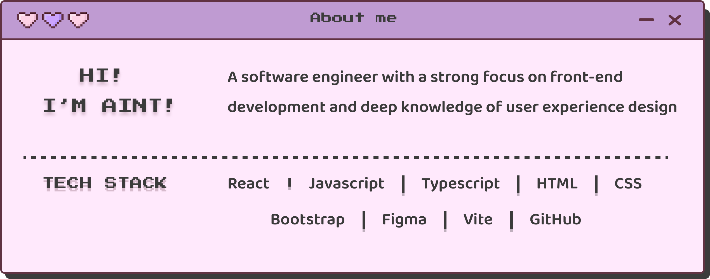

  

# 👋 Hi, I’m Aint

I’m a **Frontend Software Engineer** with a strong **product and user-experience mindset**.  
I enjoy building clear, performant interfaces and working closely with design and product to turn complex problems into simple, intuitive experiences.

---

## Tech stack

### Frontend
- React
- TypeScript / JavaScript
- HTML, CSS
- Redux

### Data & APIs
- REST APIs
- GraphQL (queries, mutations, caching concepts)

### Testing
- Jest/Vitest

### Tooling & Workflow
- Git & GitHub
- CI/CD with GitHub Actions
- Monitoring & debugging with Datadog
- Experience working in monorepos (Nx-based)

### 🤝 Connect

  
  
  

